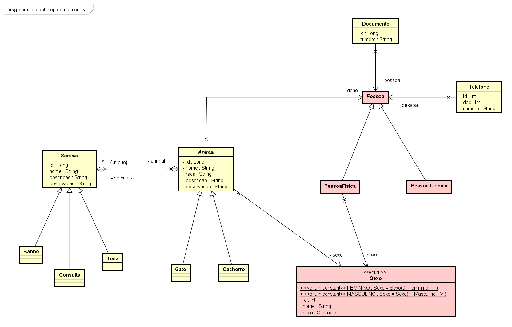
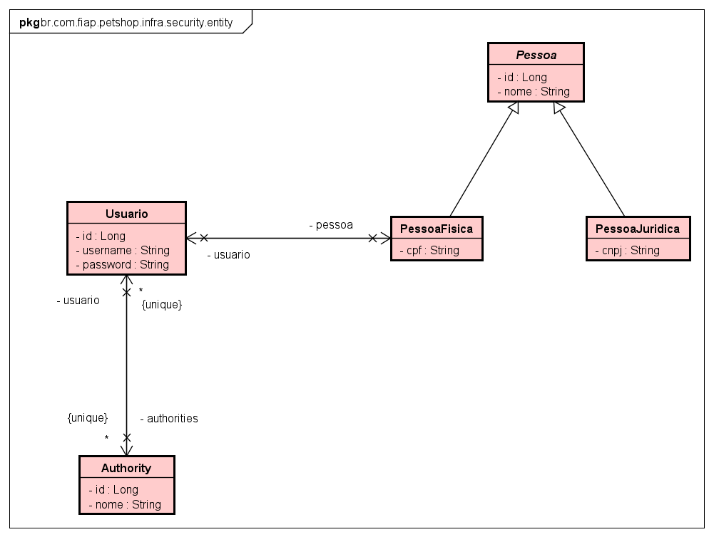

# Benezinho Petshop 🤓👍🏾

CHECKPOINT - Enterprise Application Development aplicado em 04/10/2023.


|                | **Enterprise Application Development** |
|------------------------------------------|----------------------------------------|
| **ALUNO:**                               | **TURMA:** 2TDSPR  - 2TDSPT            |
| **PROFESSOR:** Benefrancis do Nascimento | 04/10/2023                             |
| **Checkpoint**                           |                      |

# Sumário


[Estudo de caso ](#_Estudo_de_caso)

[O que deverá ser feito? ](#_O_que_devera_ser_feito)

[Diagrama de Classes ](#_Diagrama_de_Classes)

[Correção ](#_Correcao)

<a id="_Estudo_de_caso"></a>

# Estudo de caso


A Holding Benezinho  deseja atuar no ramo de Petshop fornecendo servços de Banho, Tosa, Vacinação e Consultas Veterinárias, entretanto não conseguiu encontrar no mercado um sistema para gerir este novo negócio.
Contratamos você como Engenheiro de Software para ajudar a construir esse sistema.

Na sprint atual, você foi incumbido de fazer:

1. O Mapeamento Objeto Relacional das primeiras classes envolvidas neste projeto de software;

2. A criação automatizada das tabelas no banco de dados Oracle;

3. A persistência de todos os dados, e;

4. A criação de dos métodos capazes de realizar operações no repositório respeitando a interface genérica Repository:

        1. Consulta todos os objetos findAll;
        2. Consulta Objeto pelo Id findById;
        3. Consulta Objeto pelo texto (nome, tipo de Serviço, numero de documento ou numero de telefone) conforme o caso;
        4. Persistência do Objeto;
        5. Alteração do Objeto;
        6. Exclusão do Objeto.


<a id="_O_que_devera_ser_feito"></a>

# O que deverá ser feito?


**Faça o Fork do projeto no github do professor :**

https://github.com/Benefrancis/benezinho-petshop.git

Caso o github esteja indisponível, você deverá pegar o projeto no diretório compartilhado.

**Você deverá:**

Alterar o arquivo contido em documentacao/equipe.txt para incluir os RMs e nomes e turma da dupla que fará esta atividade.

1. **(0,5 Ponto)** acessar o arquivo persistence.xml e alterar as configurações da **persistence-unit** para que seja possível conectar-se ao banco de dados Oracle da FIAP com o seu usuário e senha (manter o seu usuário e senha ativo é sua responsabilidade). Não utilize o usuário e senha de outro aluno. Caso tenha problema para autenticar, comunique o professor.

2. **(2,5 Pontos)** adicionar corretamente as anotações JPA na classe **Animal**.

   Lembre-se que:
    1. Existe Hernaça entre **Animal**, **Cachorro** e **Gato**
    2. Existe relacionamento **Muitos para Muitos** entre **Animal** e **Servico** no atributo servicos.
    3. Existe relacionamento **Muitos para Um** entre **Animal** e **Pessoa** a no atributo dono.

1. **(2 Ponto)** adicionar corretamente as anotações JPA na classe **Servico**.

   Lembre-se que:

   1. Existe Hernaça entre **Servico**, **Banho**, **Consulta** e **Tosa**

1. **(1,5 Pontos)** adicionar corretamente as anotações JPA na classe **Documento**.

   Lembre-se que:

    1. Existe relacionamento **Muitos para Um** entre Documento e Pessoa no atributo pessoa.

1. **(1,5 Ponto)** adicionar corretamente as anotações JPA na classe **Telefone**.

   Lembre-se que:

   1. Existe relacionamento **Muitos para Um** entre Telefone e Pessoa no atributo pessoa.


1. **(2 Pontos)** Implementar corretamente os métodos das classes que devem implementar a interface genérica **Repository** 

   Deverá implementar:

   1. AnimalRepository;
   2. ServicoRepository;
   3. DocumentoRepository;
   4. TelefoneRepository;

<a id="_Diagrama_de_Classes"></a>

# Diagrama de Classes de Domínio




# Diagrama de Classes de Infra e Segurança




<a id="_Correcao"></a>

# Correção da Prova

A correção da prova será disponibilizada no github do professor (branch correcao):

Para acessar digite no prompt:

```shell
git clone https://github.com/Benefrancis/benezinho-petshop.git && cd benezinho-petshop && git checkout correcao
```

A atividade é em dupla, em caso de fraude de qualquer tipo todos os envolvidos receberão nota ZERO.

Boa prova.
